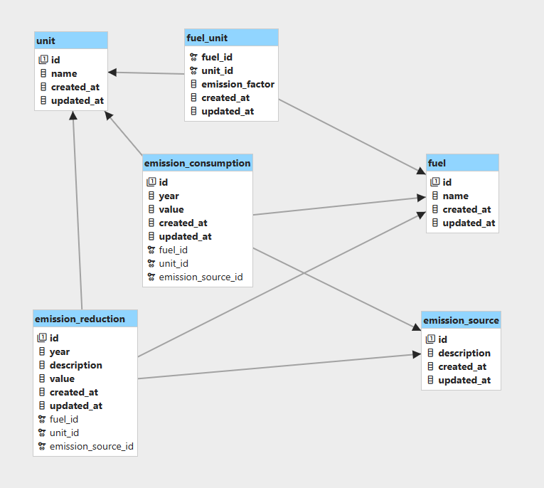

# Timeline

Estimation:

- Read the whole task description: 10 mins
- Clarify: 10 mins
- Design Database: 20 mins
- Coding & complete the database: 7 hours
- Write documentation: 2 hours

# Database

## Diagram

## Description

This project has 6 tables:

- fuel
- unit
- fuel_unit
- emission_source
- emission_consumption
- emission_reduction

I separated 2 domains:

- Factor: fuel, unit and fuel_unit (n-n)
- Inventory: emission_source, emission_consumption, emission_reduction

Explain:

- Factor: Contains fuel and its corresponding unit of measurement. Each fuel may be measured by multiple units, and conversely, each unit can be used to
  measure multiple fuels. Corresponding to each fuel, there will be emission factors converted and stored in the fuel_unit table
- Inventory: The inventory is used to store emissions sources, their consumption, and reduction measures. The consumption and reduction measures
  are linked to a fuel and correspond to a unit of measurement for that fuel.

Additional:

- The scope of project just converts with kgCO2e, in the future, this project can scales for too many emission like CFCs,
  we can add more table to store emission.

- Tables of Factor: Emission, Fuel, Unit

# Feature

## Factor

I have written a script to run a simple seed for the factor domain in app.service.ts

When you start application, the initial data will be created for all tables of Factor domain

Scripts and mock data:

- Initial data: [link](../../src/db/seeds/)
- Script run seed: [link](../../src/db/scripts.ts)
- Implement: [link](../../src/app.service.ts#L13)

## Emission Consumption & Reduction

### Create and Update

I have bound not to duplicate fuel, unit, and 1 year when creating and updating.

I will check the database first for the payload about unit, fuel, and year, if it doesn't exist yet, then allow the creation or update process

You can read in:

- Create an emission consumption: [link](../../src/features/inventory/services/emission-consumption/emission-consumption.service.ts#L169)
- Update an emission consumption: [link](../../src/features/inventory/services/emission-consumption/emission-consumption.service.ts#L381)
- Create an emission reduction: [link](../../src/features/inventory/services/emission-reduction/emission-reduction.service.ts#L92)
- Update an emission reduction: [link](../../src/features/inventory/services/emission-reduction/emission-reduction.service.ts#L255)

## Util

It's just a service which i implemented 2 features:

- Prediction: [link](../../src/features/inventory/services/emission-util/emission-util.service.ts#L104)
- Total emission: [link](../../src/features/inventory/services/emission-util/emission-util.service.ts#194)

With Prediction feature, i implemented with 2 ways:

- Linear Regression:
  - Knowledge: [aws](https://aws.amazon.com/what-is/linear-regression/)
  - Reason: Based on my research and my knowledge, using linear regression seems reasonable for this problem
  - Implement: Install library at [npm](https://www.npmjs.com/package/ml-regression)
- Growth Rate Formula:
  - Knowledge: [link](https://www.paddle.com/resources/growth-rate)
  - Implement: [link](../../src/features/inventory/services/emission-util/prediction.util.ts)
    - Reason: I think that the annual greenhouse gas emissions consumption is likely to increase in future years. Therefore, using the growth formula here is reasonable
    - Step:
      - Calculate the avg of growth rate with the historic consumption data
      - Calculate the Predicted value with last year by formula: `lastYearConsumedValue * (1 + averageGrowthRate)`, I assume that the amount of emissions released annually consistently reaches 100%, it's the meaning of number 1

## Additional 

In this project, due to time constraints, I have simplified the structure and cannot fully implement certain aspects such as the DAO pattern, database indexing, table constraint or additional features in the API such as sorting and paging, full validation for query string , parameter etc.

When you read this line, we will conclude the documentation for this project. I am very grateful to the team and the company for giving me the time and opportunity to test my skills and learn about the company.

If you have any questions or need further assistance, please do not hesitate to contact me.

I sincerely thank you and wish you good health.

## Related Documents

- Instructions Documentation: [link](../../README.md)
- APIs Documentation: [link](../apis/readme.md)
- Database Diagram: [link](./documents/core/db-diagram.png)